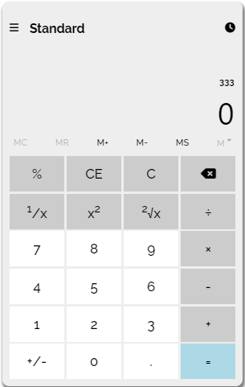

# Windows-10-Calculator
Try it out and perform calculations effortlessly with this Windows 10 calculator clone!
# Windows 10 Calculator

A replica of the Windows 10 calculator built using HTML, CSS, and JavaScript.



## Features

- Basic arithmetic operations: addition, subtraction, multiplication, and division.
- Clear button to reset the calculator.
- Decimal point support for precise calculations.
- Responsive design for optimal viewing on different devices.
- Intuitive user interface resembling the Windows 10 calculator.

## Demo

You can try out the Windows 10 Calculator [here]([https://your-calculator-url.com](https://ben64103.github.io/Windows-10-Calculator/)).

## Getting Started

To get a local copy up and running, follow these steps:

1. Clone the repository: 
   ```
   git clone https://github.com/ben64103/windows-10-calculator.git
   ```

2. Open the `index.html` file in your preferred web browser.

3. Start performing calculations using the Windows 10 Calculator.

## Contributing

Contributions are welcome! If you have any suggestions, bug fixes, or additional features to add, please open an issue or submit a pull request. 

## Acknowledgements

- This project was inspired by the design and functionality of the Windows 10 calculator.
- [FontAwesome](https://fontawesome.com) - Used for icons.


